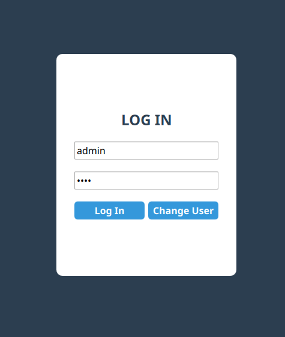
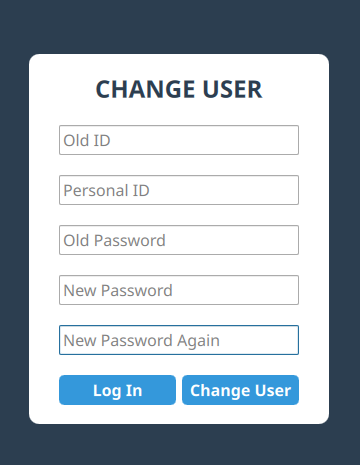
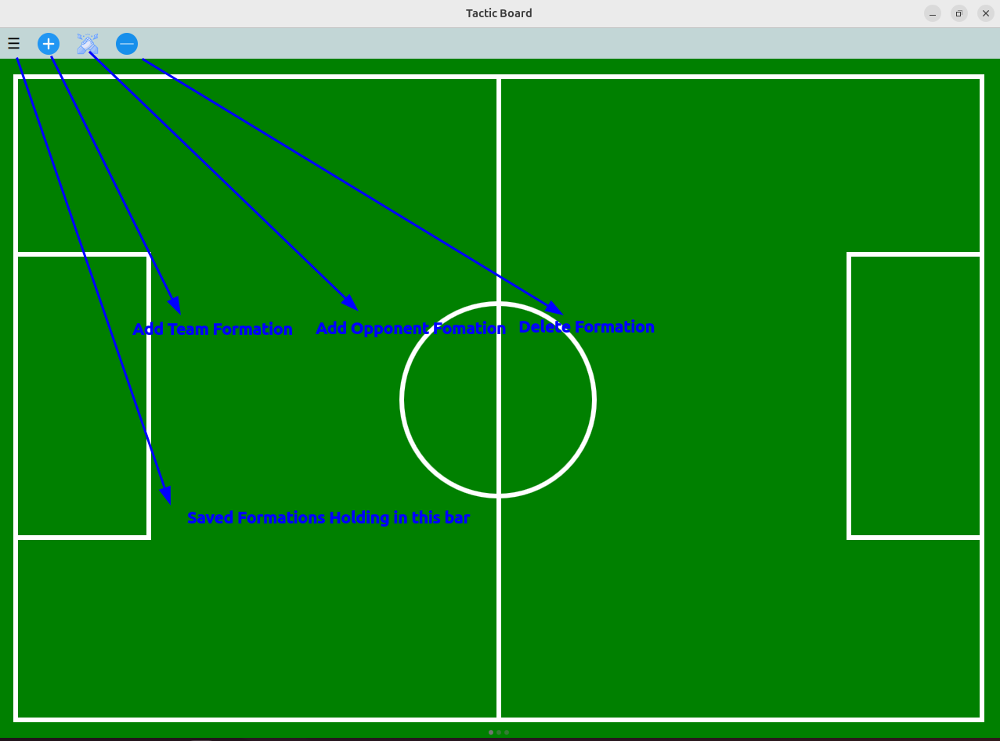
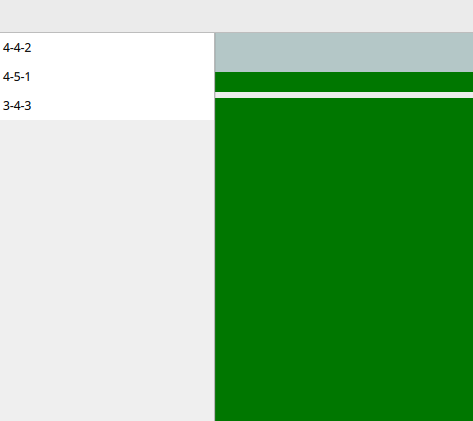
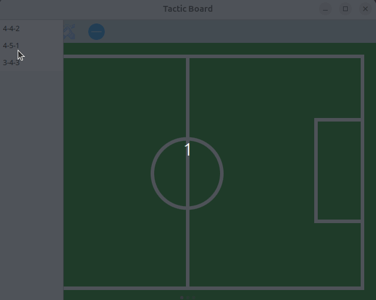
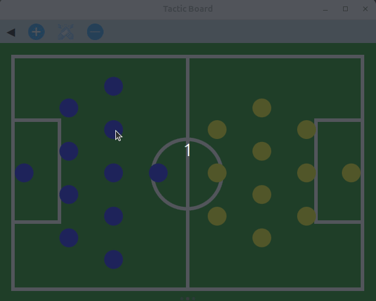

# Tactic Board - Football Strategy & Formation Manager 

**Tactic Board**, teknik direktörlerin ve futbol analistlerinin hem kendi takımlarının hem de rakiplerinin saha içi dizilişlerini simüle etmelerini sağlayan, modern ve etkileşimli bir masaüstü uygulamasıdır. **Qt/QML** ve **C++** gücüyle geliştirilen uygulama, taktiksel varyasyonları kalıcı bir veri tabanında saklayarak veri kaybını önler.

## 🚀 Öne Çıkan Özellikler

* **Üçlü Diziliş Sistemi:**
    * **Kullanıcı adı ve Parola ile giriş:** Hem çalışmaların güvenliği hemde aynı cihazda farklı id lerin çalışmalarının ayrı yutulabilmesi amaçlanmıştır.   
    * **Genel Diziliş:** Sadece kendi takımınızın temel yerleşimine odaklanın.
    * **Toplu (Attacking) Diziliş:** Kendi takımınız ve rakip takımın hücum varyasyonlarını eş zamanlı görün.
    * **Topsuz (Defensive) Diziliş:** Savunma yerleşimlerini ve rakibe karşı pozisyon almayı analiz edin.
* **İnteraktif Sürükle-Bırak (Drag & Drop):** Formasyonu seçtikten sonra her bir oyuncuyu saha üzerinde dilediğiniz gibi konumlandırabilirsiniz.
* **Kalıcı Veri Depolama:** Oyuncu konumları ve seçilen formasyonlar **SQLite** veri tabanında tutulur. Uygulamayı kapatsanız bile çalışmalarınız güvendedir.
* **Modern UI:** QML ile geliştirilmiş, akıcı ve kullanıcı dostu arayüz.

## 📸 Ekran Görüntüleri

| Giriş Ekranı | Kullanıcı Oluşturma Ekranı | 
| :--- | :--- | 
|  | | 
| Genel Diziliş | Formasyonların tutulduğu menü |
|  | 


## 📽️ Kullanım Kesitleri
|Formasyon Ekranı|
| :--- |
|  |
|Sürükle Bırak ve Pozisyon Kaydolması özelliği|
|  |

## 🛠️ Teknik Altyapı

* **Frontend:** Qt Quick / QML
* **Backend:** C++ (Qt Framework)
* **Veri Tabanı:** SQLite
* **Platform:** Cross-platform (Windows & Linux Support)

## ⚙️ Kurulum ve Çalıştırma

### Windows
1. [Releases](../../releases) sayfasından en güncel `.zip` paketini indirin.
2. Dosyaları bir klasöre çıkarın.
3. `apptactic_board.exe` dosyasını çalıştırın.

### Linux
1. [Releases](../../releases) sayfasından en güncel `.AppImage` yi indirin.
2. imajı bir klasöre çıkarın.
3. imajı çalıştırın.
4. Eğer AppImageLauncher kuruluysa linux releaseindeki yönelgeyi uygulayıp uygulama menünüze uygulamayı ekleyebilirsiniz.Hızlı kullanım için run as program seçeneği ile hemen .AppImage yi açıp uygulamayı kullanabilirsiniz.

# Yocto
yocto imajınız için https://github.com/EmreBilal98/Tactic-Board-Yocto-Layer reposundaki layerı imajınıza ekleyebilirsiniz.

### Geliştiriciler İçin (Derleme)
```bash
# Repoyu klonlayın
git clone [https://github.com/EmreBilal98/Tactic-Board.git](https://github.com/EmreBilal98/Tactic-Board.git)

# Build dizini oluşturun
mkdir build && cd build

# CMake ile yapılandırın ve derleyin
cmake ..
make
